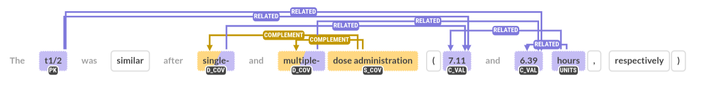

# PKRelations

#### Types of entities:

1. **PK**: Mention of a pharmacokinetic parameter 

2. **C_VAL**: Central value of a PK parameter

3. **C_TYPE**: Type of central value, e.g. mean, median, population, individual

4. **D_VAL**: Deviation measurement

5. **D_TYPE**: Type of deviation measurement, e.g. variance, standard deviation, IIV, +-

6. **RANGE_MIN**: PK minimum value when a range is expressed e.g. midazolam's renal clearance went from _**4**_ to 7 mg/hL

7. **RANGE_MAX**: PK maximum value when a range is expressed e.g. midazolam's renal clearance went from 4 to _**7**_ mg/hL

8. **COMPARATIVE**: That's a complement of C_TYPE to specify whether instead of purely a central value it says: "higher", "less", ">","<". e.g. Clearance rate was ">"20mg/hL

9. **UNITS**: **Any** units mentioned in the sentence 

10. **COV**: Covariate that complements the value of the parameter

11. **CHEMICAL**: Pre-highlighted by bio-bert but worth to check/modify (screenshot if that happens)
12. **DISEASE**: Pre-highlighted by bio-bert but worth to check/modify (screenshot if that happens)
13. **SPECIES**: Pre-highlighted by bio-bert but worth to check/modify (screenshot if that happens)

14. **DOSAGE**?: Central value of a dosage administered to a patient (the relation between this and the units will be considered by the RELATED type)

#### Relation types:

1. **RELATED**: Main type of relation. Usually this gets assigned between all entities and C_VAL or RANGE_MIN, RANGE_MAX. Also RANGE_MIN should almost always have a RELATED that points towards RAGE_MAX.
2. **COMPLEMENT**: This happens when a single covariate needs to be splitted into two or more tokens, in this case the main covariate complements the type. Example: 

